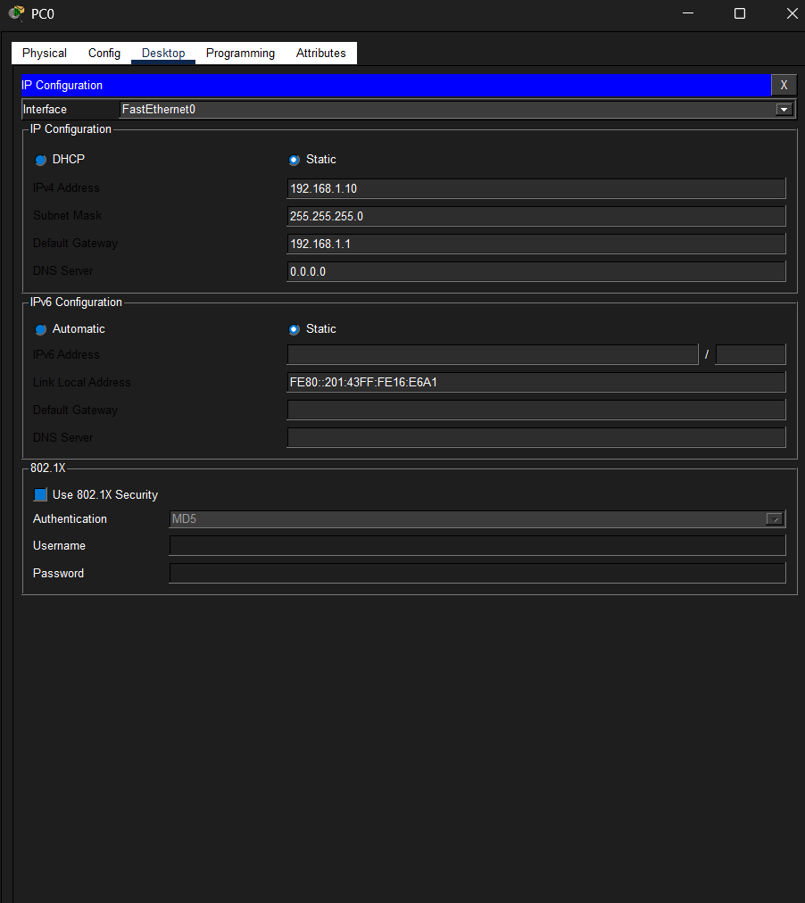
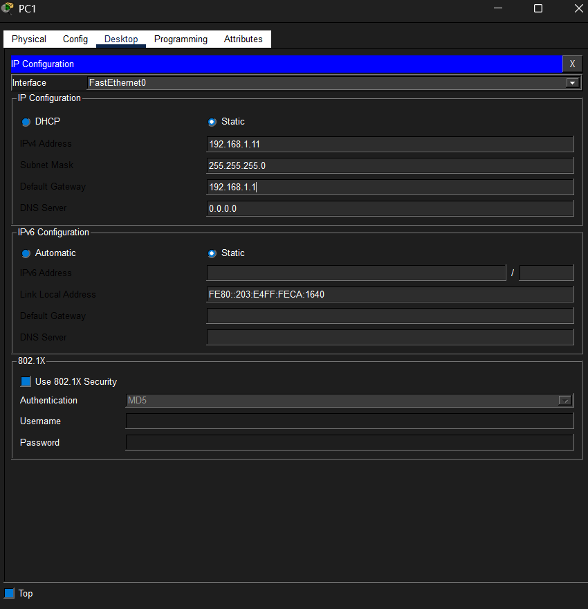
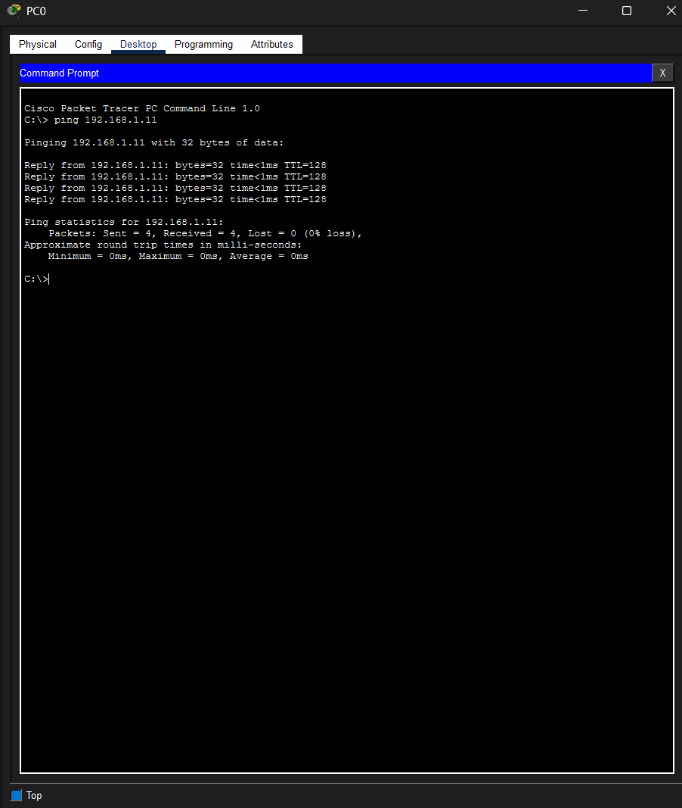
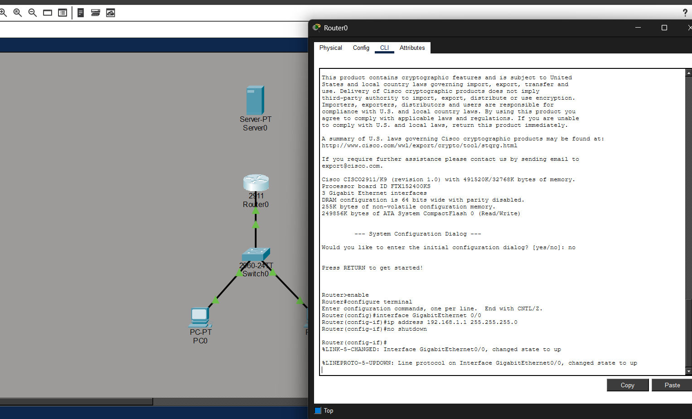
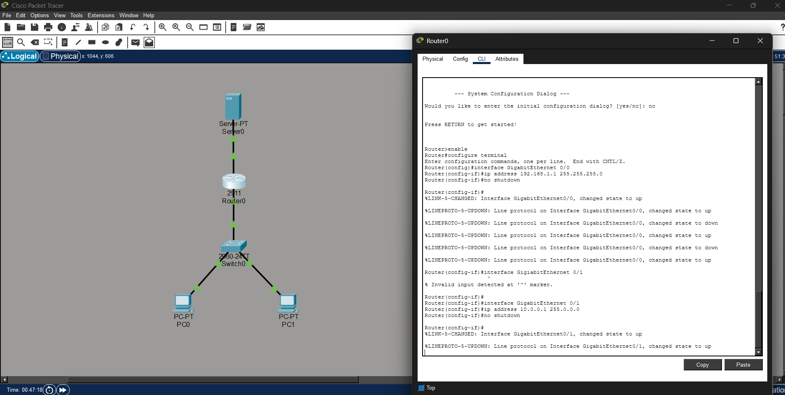
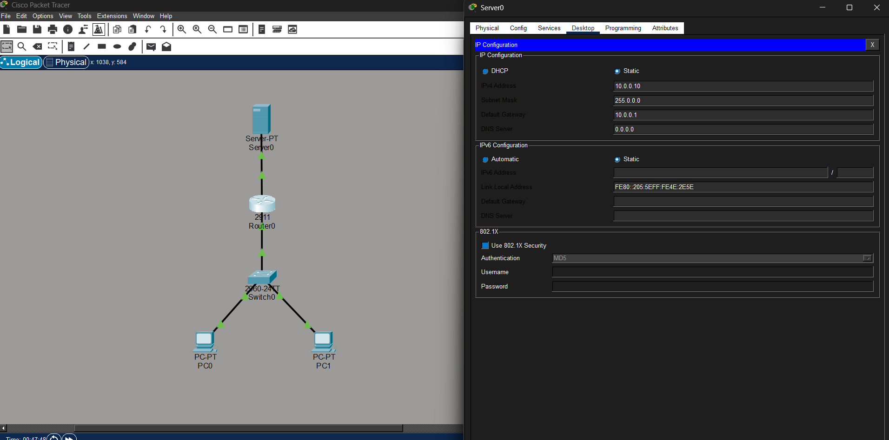
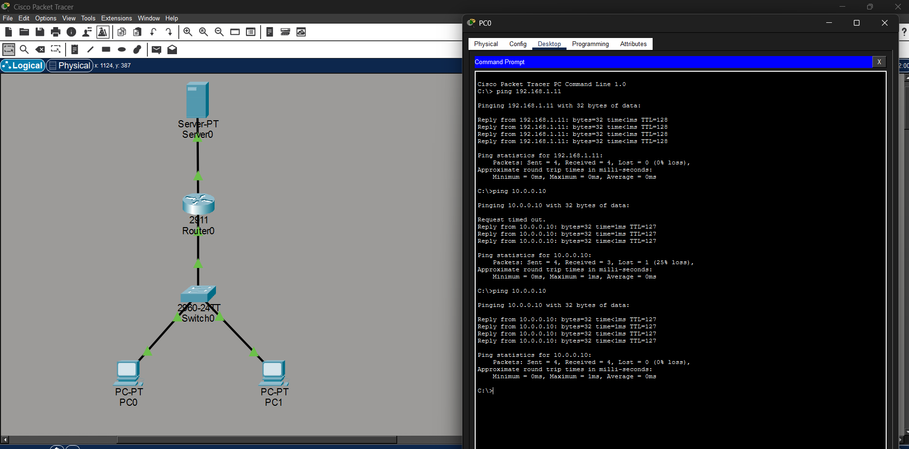
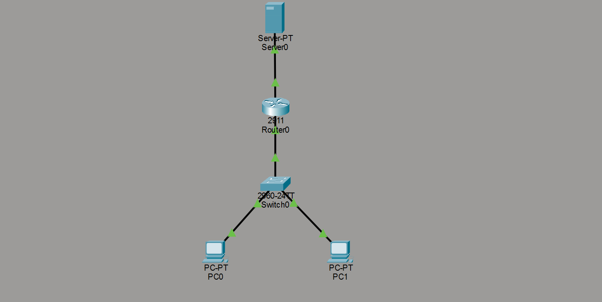

# Cisco-Packet-Tracer-Small-Network-Lab
I built a small routed network using the Cisco Packet Tracer, involving 2 PCs, a Switch, a Router, and Server connectivity testing.

## Overview
This lab demonstrates a basic routed network that I built in Cisco Packet Tracer. The network includes two PCs connected to a switch, which connects to a router and server. The goal was to configure basic network settings and verify device connectivity.

## Network Topology
- PC0
- PC1
- Switch
- Router
- Server

## Skills Demonstrated

- Network topology design
- Cisco IOS basic configuration
- IPv4 addressing
- Default gateway configuration
- Router interface configuration
- End-to-end connectivity testing
- Troubleshooting network communication

## Lab Objectives
- Connect end devices to a switch
- Connect the switch to a router
- Connect the router to a server
- Assign IP addresses to devices
- Configure default gateways
- Verify connectivity between devices
- Troubleshoot any connection issues

## Configuration Summary
| Device | Purpose |
|---|---|
| PC0 | End-user workstation |
| PC1 | End-user workstation |
| Switch | Connects local devices |
| Router | Routes traffic between networks |
| Server | Provides network service endpoint |

## Testing
Connectivity was tested using ping between devices to confirm that the network was configured correctly.

# Screenshots

# PCs IP Configuration

# Ping Test between PC0 and PC1 (Successful)

# Router to Switch Configuration

# Router to Server Configuration

# Server Configuration

# Final Ping Test

# Overall Packet Tracer Setup Layout

## What I Learned
Through this lab, I practiced configuring a basic network, assigning IP addresses, using default gateways, and validating connectivity between devices. This helped reinforce networking fundamentals such as switching, routing, and troubleshooting connectivity issues.

## Tools Used
- Cisco Packet Tracer
- Windows PC
